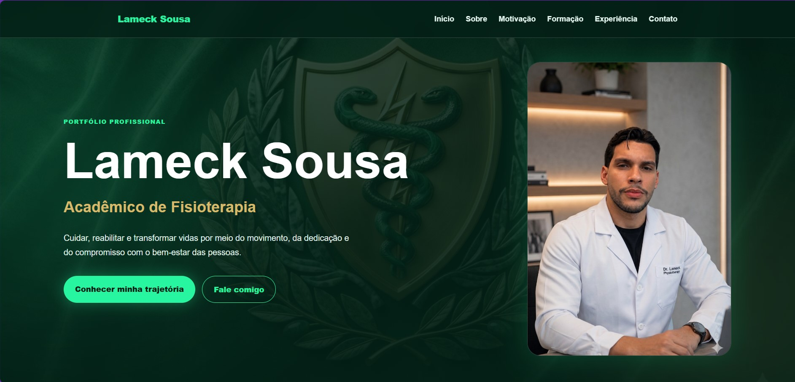
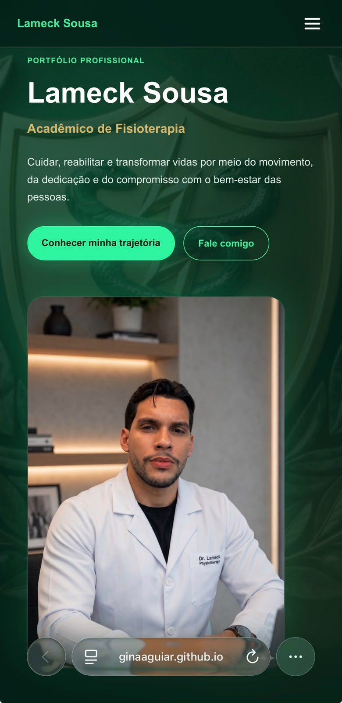

# 🩺 Landing Page - Lameck Sousa | Acadêmico de Fisioterapia

Landing Page profissional desenvolvida para **Lameck Sousa**, acadêmico de Fisioterapia pela **UNINASSAU**, com o objetivo de apresentar sua trajetória acadêmica e profissional, fortalecer sua presença digital, ampliar oportunidades de networking e facilitar o contato para futuras oportunidades de estágio e atuação na área da saúde.

## 🚀 Acesse o projeto

🌐 **Site Online (Netlify):**
https://portifolio-fisioterapia-lameck.netlify.app/

📂 **Repositório GitHub:**
https://github.com/GinaAguiar/Landing-Page-Estudante-de-Fisioterapia

## 📸 Capturas de Tela

### 💻 Versão Desktop

### 📱 Versão Mobile

## ✨ Funcionalidades

* Apresentação profissional do acadêmico;
* Seção "Sobre Mim";
* História e motivação para a escolha da Fisioterapia;
* Formação acadêmica;
* Experiência profissional;
* Habilidades e competências;
* Links para redes sociais e contato;
* Menu responsivo para dispositivos móveis;
* Animações suaves ao scroll;
* Botão de retorno ao topo;
* Layout responsivo para desktop, tablet e smartphone;
* Boas práticas de acessibilidade (A11Y);
* Otimizações de performance e SEO.

## 🛠️ Tecnologias Utilizadas

* HTML5
* CSS3
* JavaScript (Vanilla JS)
* Flexbox
* CSS Grid
* Responsive Design

## 🎯 Objetivo do Projeto

Desenvolver uma Landing Page moderna, elegante e profissional para destacar a trajetória acadêmica e profissional de Lameck Sousa, fortalecendo sua marca pessoal e ampliando sua visibilidade no mercado da saúde.

## 📱 Responsividade

O projeto foi desenvolvido seguindo a abordagem Mobile First Adaptada, garantindo uma boa experiência de navegação em:

* Smartphones
* Tablets
* Notebooks
* Monitores Desktop

## ♿ Acessibilidade

O projeto contempla recursos de acessibilidade como:

* Navegação por teclado;
* Uso de atributos ARIA;
* Estrutura semântica HTML;
* Contraste visual aprimorado;
* Foco visível em elementos interativos.

## 👨‍⚕️ Sobre o Cliente

**Lameck Sousa** é acadêmico do 6º período de Fisioterapia pela UNINASSAU, apaixonado pela área da saúde e interessado especialmente em:

* Quiropraxia
* Fisioterapia Respiratória
* Reabilitação Funcional
* Qualidade de Vida

## 👩‍💻 Desenvolvedora

Projeto desenvolvido por **Gina P. Aguiar**.

GitHub: https://github.com/GinaAguiar

LinkedIn: https://www.linkedin.com/in/gina-aguiar

---

⭐ Se este projeto foi interessante para você, deixe uma estrela no repositório.
